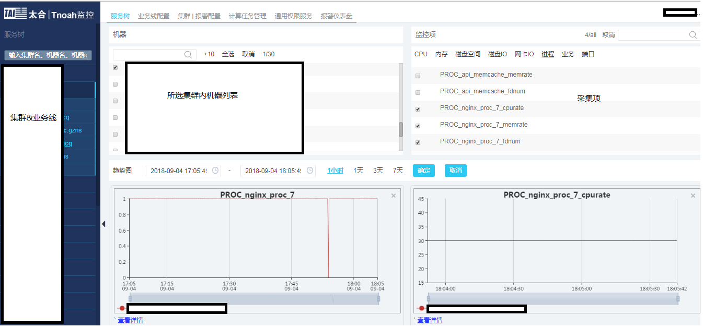
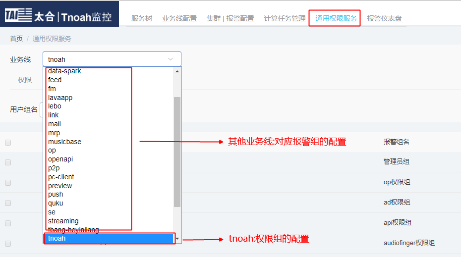
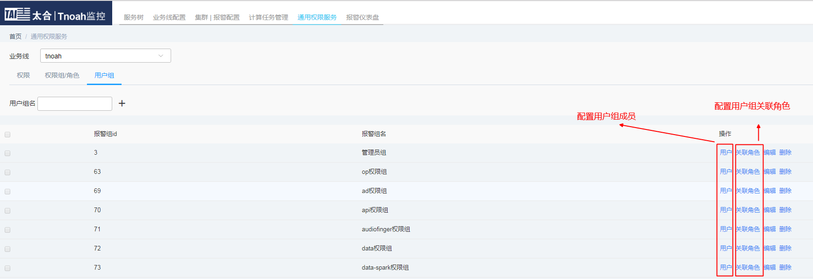
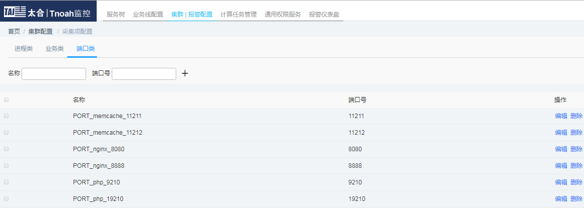
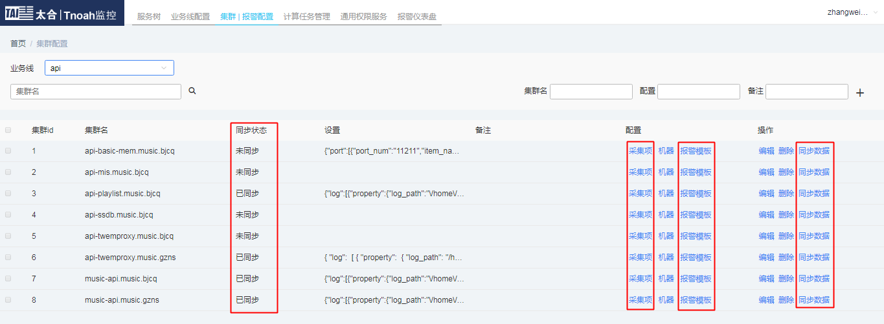
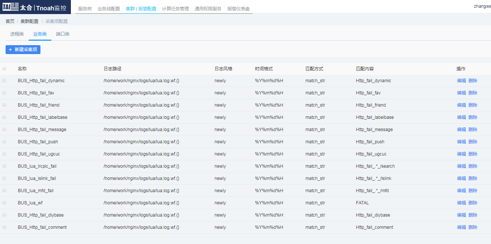
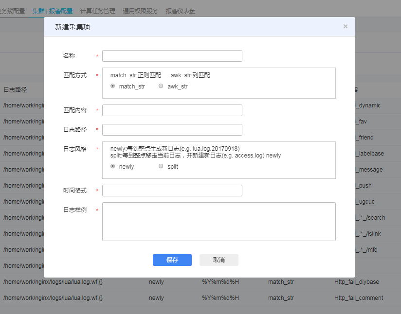
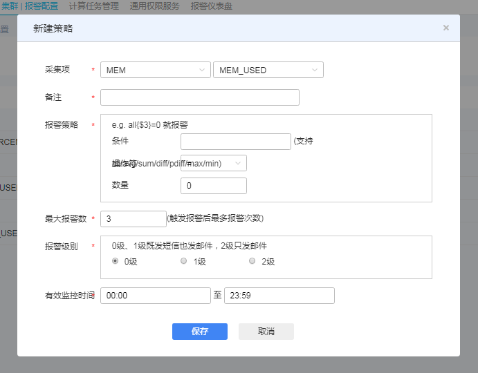

# Tnoah——一套可配置, 机器级别的采集&报警系统

__文档大纲__ 
* 1 概述
* 2 模块介绍&部署
    * 2.1 tagent介绍&部署
    * 2.2 实时计算模块介绍&部署
    * 2.3 judge模块介绍&部署
    * 2.4 alarm模块介绍&部署
    * 2.5 web平台介绍&部署
* 3 Tnoah使用手册
    * 3.1 权限配置
    * 3.2 端口采集项配置
    * 3.3 进程采集项配置
    * 3.4 日志采集项配置
    * 3.5 报警项配置 

## 1 概述
一套可配置, 机器级别的采集+报警系统。组成部分：
* tagent: 部署在每台机器上的"探针"
* 实时计算模块
* judge模块 (基于open-falcon二次开发)
* alarm模块 (基于open-falcon二次开发)
* tnoah web平台(前端+api+权限服务)

## 2 模块介绍&部署
### 2.1 tagent介绍&部署
tagent是一个使用C++实现的高性能探针, 是系统的采集部分, 支持配置&热加载,
目前tagent支持以下信息的采集
* 机器上设备硬件信息, 包括：
    * CPU相关信息
    * 内存相关信息
    * 磁盘 
    * 磁盘I/O、
    * 网卡信息、
    * 网卡I/O、
* (可配置)进程存在性检验、进程fd数目、进程内存占用、进程CPU空闲率率
* (可配置)端口存在性校验
* (可配置, 支持正则)业务日志相关信息

__tagent的部署方式__
include/ lib/ 路径下采用了一些较大体积的第三方库, 使用前需要解压至原始路径
1)./src/Global.h:283 文件中修改kafka机器地址 

        const char* brokers  = "xxx.xxx.xxx.xxx:port,xxx.xxx.xxx.xxx:port,xxx.xxx.xxx.xxx:port"; // 修改此处
2)./data/topic 文件中,将内容"example_topic"替换为实际kafka使用的topic
3).执行 make output, 在tagent目录下得到一个新生成的目录 output
4).执行命令

    cp -r output /usr/local/tagent
    cd /usr/local/tagent && chmod u+x load_agent.sh && ./load_agent.sh start
启动后, tagent采集,并向kafka发送数据,同时发送的内容会在data路径下存一份便于查看,data下的文件需要手动实现切割脚本

### 2.2 实时计算模块介绍&部署 (依赖spark集群)
部署git中提供的scala代码至自己的spark集群并启动  需要确保消费的topic与tagent传输的是同一个
部署前需要修改代码文件中的地址: 以下是需要改动的文件,将文件中的"***.***.***.***"替换为实际服务的ip地址, 将port替换为实际服务的端口地址
* mainpro_1.scala : kafka配置
* mainpro_2.scala : kafka配置、SSDB地址
* mainpro_3.scala : jedis地址
* RedisUtil.java  : Redis地址

### 2.3 judge模块介绍&部署
judeg模块基于open-falcon模块, 并进行了一些二次开发
编译、部署流程见 http://book.open-falcon.com/zh/install_from_src/judge.html

### 2.4 报警模块介绍&部署
alarm模块同样基于open-falcon模块, 并进行了一些二次开发
编译、部署流程见 http://book.open-falcon.com/zh/install_from_src/alarm.html

### 2.5 web平台
web平台包括三部分组成:
* 前端(vue.js)
* API接口(nginx+PHP)
* 权限服务(nginx+lua)

####前端&API接口部署 (npm环境依赖)
部署流程：
1、权限服务
2、api
3、web

__权限服务部署__ 
权限服务使用openresty搭建, 下述流程假定已经搭建了openresty, 权限部署流程:
1). 将git中的nginx配置文件拷贝至nginx的conf内, 并使之生效
2). 修改配置文件中的地址: 以下是需要改动的文件,将文件中的"***.***.***.***"替换为实际服务的ip地址, 将port替换为实际服务的端口地址
* ./api/conf/db.lua
* ./api/conf/redis.lua
3). 启动服务: 配置完成后启动openresty服务器

__api部署__
1).api采用odp搭建, 首先需要修改一些配置文件中的地址: 以下是需要改动的文件,将文件中的"***.***.***.***"替换为实际服务的ip地址, 将port替换为实际服务的端口地址
* ./app/action/hbase/CtDataToRedis.php    :redis地址
* ./app/action/hbase/GetHbaseData.php     :redis地址、ssdb地址
* ./app/action/hbase/InnerData.php        :ssdb地址
* ./app/action/hbase/SsdbMutiGet.php      :ssdb地址
* ./app/action/manage/GetEventIpsShow.php :redis地址
* ./app/action/spark/SparkSubmit.php      :spark地址、spark-api地址
* ./library/tnoah/HttpProxy.php           :这个类实现一些http请求,并做了外网代理, 可以根据需要进行改写 
* ./script/setGroupConf.php               :数据库地址
* ./scripy/ssdb2redis.php                 :redis地址、ssdb地址

__web部署__
1).修改配置文件中的地址: 以下是需要改动的文件,将文件中的"***.***.***.***"替换为实际服务的ip地址, 将port替换为实际服务的端口地址
* ./src/Js/config.js 修改权限服务的地址
* ./phpcas/libraries/CAS.php 修改CAS服务的地址
* ./phpcas/libraries/CAS/config.php 修改CAS服务的地址
* ./phpcas/libraries/config.php 修改api的地址 

2).执行下面的操作编译生成代码,保存在dist路径下

    先npm install初始化获取node_modules
    运行命令在tnoah_fe目录下npm run dev
    编译命令在tnoah_fe目录下npm run build，会将代码编译至dist目录
    只需将dist目录拷贝至webroot即可

3).将dist路径拷贝(或软连接)至tnoah web路径下

    cp -r dist ./odp/webroot/

## 3 Tnoah使用手册
访问启动好的web页面, 如果部署顺利, 则会进入tnoah平台主页:

接下来主要介绍一些需要配置的地方

### 3.1 权限配置
权限配置主要有两处需要配置的地方:
* 平台权限 :  包括对监控项、报警项的CRUD操作
* 报警组  : 以集群为单位, 设置报警组及组内成员
具体配置如下图所示:

首先配置tnoah业务线下的权限,tnoah业务线用来配置tnoah平台的权限,配置方式如下图所示:

接下来配置具体业务线下的报警组,配置方式如下图所示:

__[注]__ __是否添加权限只会决定用户是否拥有修改相应集群配置采集项、报警项的权限, 即使没有权限依然能够正常浏览已配置的监控项的数据__
  
### 3.2 端口采集项配置
  

  
  
### 3.3 进程采集项配置
  

__[注]__ __进程配置需要配置进程的绝对路径&命令,例如:__
~~nginx~~
~~/home/work/odp/webserver/sbin/nginx -p /home/work/odp/webserver -c ./conf/nginx.conf~~ (这种"命令" + "参数" 的配置方式暂时不支持)
/home/work/odp/webserver/sbin/nginx
  
  
### 3.4 日志采集项配置
  

  

  

* newly风格的日志路径参考:/home/work/nginx/logs/lua/lua.log.wf.{}
* 时间格式参考:%Y%m%d%H
  
__[注]__ __已经配置的业务类采集项不支持修改名称、日志路径、时间格式:__
__[注]__ __修改业务类监控项后需要手动下发配置__
__[注]__ __同步是串行的,机器较多的集群同步速度较慢__
__[注]__ __BUS_TAgent_Heartbeat是一条用来探活的采集项__
  
## 报警项配置
  
* 报警模板
* 模板复制

  

  
__[注]__ __所有业务类采集项的报警策略中,报警阈值要乘以10(以一秒钟的值作为单位)__
